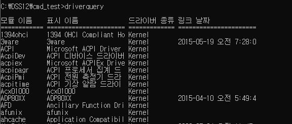
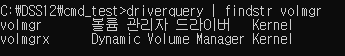
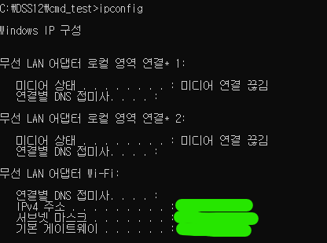
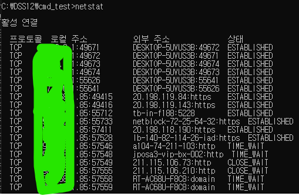
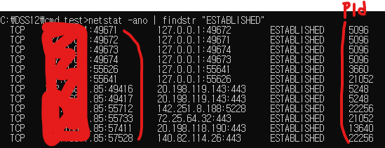
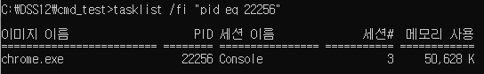
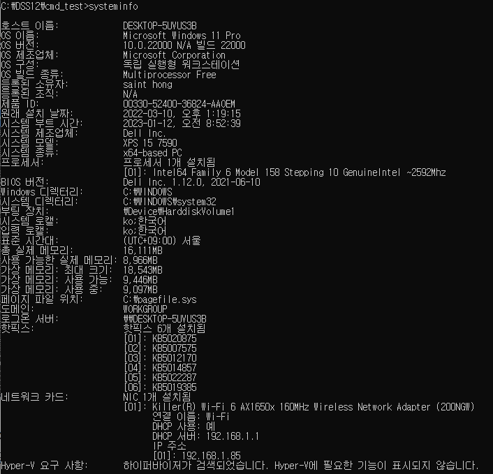

# 커맨드 명령어
- 기본 명령어
- 유용한 명령어

### 커맨드 창 켜는 방법
- 윈도우 키 + R -> cmd 입력

## 1. 기본 명령어

### 1-1. dir
- 디렉토리의 목록

```python
dir : 현재 디렉토리의 파일 목록
dir .. : 상위 디렉토리의 파일 목록
dir ..\.. : 상위의 상위 디렉토리 파일 목록
dir ..\all_data\ : 상위의 디렉토리 목록에서 all_data 디렉토리의 파일 목록
```

### 1-2. cd
- 디렉토리 이동

```python
cd 010_my_summary : 현재 디렉토리에서 010_my_summary 디렉토리로 이동
cd .. : 상위 디렉토리로 이동
cd ..\.. : 상위의 상위 디렉토리로 이동
```

### 1-3. copy, move
- 파일 복사
    - copy <복사대상의 경로+파일이름> <복사 위치의 경로+파일이름>
    - 복사 할 때 파일명을 바꿔도 된다.
- move : 파일 이동
    - copy와 같은 방식
    - move 를 현재 디렉토리로 지정해주면 파일의 이름을 바꿀 수 있다.

```python
copy ..\all_data\wine_data\wine_red.csv .\wine_red.csv : 상위디렉토리->all_data->wine_data->wine_red.csv 파일을 현재 디렉토리에 복사
```

### 1-4. cls
- 커맨트 창의 명령-실행 내용 지우기
    - 또는 화면을 위로 스크롤하면 마지막 명령줄이 첫줄이 된다.

### 1-5. type
- txt 파일을 화면에 보여준다.

### 1-6. exit
- 명령프롬프트 창 닫기

### 1-7. 실행 중단/일시정지
- ctrl+C

### 1-8. 명령어 히스토리
- 위쪽 방향키 : 이전에 실행한 명령어
- 아래쪽 방향키 : 이전에 실행한 명령어에서 다음 명령어 검색

### 1-9. help
- 커맨드 명령어들에대한 간략한 설명

```python
특정 명령어에 대한 자세한 내용이 필요하면 HELP 명령어 이름을 입력하십시오.
ASSOC    파일 확장명 연결을 보여주거나 수정합니다.
ATTRIB   파일 속성을 표시하거나 바꿉니다.
BREAK    확장된 CTRL+C 검사를 설정하거나 지웁니다.
BCDEDIT        부팅 로딩을 제어하기 위해 부팅 데이터베이스에서 속성을 설정합니다.
CACLS    파일의 액세스 컨트롤 목록(ACL)을 표시하거나 수정합니다.
CALL     한 일괄 프로그램에서 다른 일괄 프로그램을 호출합니다.
CD       현재 디렉터리 이름을 보여주거나 바꿉니다.
CHCP     활성화된 코드 페이지의 번호를 표시하거나 설정합니다.
CHDIR    현재 디렉터리 이름을 보여주거나 바꿉니다.
CHKDSK   디스크를 검사하고 상태 보고서를 표시합니다.
CHKNTFS  부팅하는 동안 디스크 확인을 화면에 표시하거나 변경합니다.
...
```
- 특정한 명령어에 대한 부분만 선택

```python
help | findstr COPY

>>> print

COPY     하나 이상의 파일을 다른 위치로 복사합니다.
ROBOCOPY       파일과 디렉터리 트리를 복사할 수 있는 고급 유틸리티입니다.
XCOPY          파일과 디렉터리 트리를 복사합니다.
```

### 1-10. /? : 명령어의 도움말
- <명령어> /? : 해당 명령어의 사용법과 도움말 출력

```python
ping /?

>>> print

사용법: ping [-t] [-a] [-n count] [-l size] [-f] [-i TTL] [-v TOS]
            [-r count] [-s count] [[-j host-list] | [-k host-list]]
            [-w timeout] [-R] [-S srcaddr] [-c compartment] [-p]
            [-4] [-6] target_name

옵션:
    -t             중지될 때까지 지정한 호스트를 ping합니다.
                   통계를 보고 계속하려면 <Ctrl+Break>를 입력합니다.
                   중지하려면 <Ctrl+C>를 입력합니다.
    -a             주소를 호스트 이름으로 확인합니다.
    -n count       보낼 에코 요청의 수입니다.
    -l size        송신 버퍼 크기입니다.
    -f             패킷에 조각화 안 함 플래그를 설정(IPv4에만 해당)합니다.
    -i TTL          Time To Live
    -v TOS         서비스 종류(IPv4에만 해당. 이 설정은 더
                   이상 사용되지 않으며 IP 헤더의 서비스 종류 필드에 영향을
                   주지 않음)입니다.
    -r count       count 홉의 경로를 기록합니다(IPv4에만 해당).
    -s count       count 홉의 타임스탬프(IPv4에만 해당)입니다.
    -j host-list   host-list에 따라 원본 라우팅을 완화합니다(IPv4에만 해당).
    -k host-list   host-list에 따라 원본 라우팅을 강화합니다(IPv4에만 해당).
    -w timeout     각 응답의 대기 시간 제한(밀리초)입니다.
    -R             라우팅 헤더를 사용하여 역방향 라우팅도
                   테스트합니다(IPv6에만 해당).
                   RFC 5095에 따라 이 라우팅 헤더는 사용되지
                   않습니다. 이 헤더를 사용할 경우 일부 시스템에서 에코
                   요청이 삭제될 수 있습니다.
    -S srcaddr     사용할 원본 주소입니다.
    -c compartment 라우팅 컴파트먼트 ID입니다.
    -p             Hyper-V 네트워크 가상화 공급자 주소에 대해 ping을 수행합니다.
    -4             IPv4를 사용합니다.
    -6             IPv6을 사용합니다.
```


## 2. 유용한 명령어

### 2-1. findstr
- 어떤 명령어의 실행결과에서 특정한 문구를 검색하여 그 실행결과만 따로 보여준다.
    - <명령어> | findstr <검색할 문구>
    - | 는 앞의 내용을 뒤로 넘겨주는 기능

#### 드라이버 목록에서 볼륨 관리자 드라이버만 검색

```python
driverquery : 내 컴퓨터에서 사용하고 있는 모든 드라이버의 목록
```


```python
driverquery | findstr volmgr
```


### 2-2. ipconfig
- 컴퓨터의 IP 구성정보 확인
    - 실제로 내 컴퓨터가 사용하고 있는 IP
    - 공유기에서 할당하는 IP
- 공인 IP가 아니다. : 정확한 의미 확인할 것

```python
ipconfig
```


### 2-3. netstat
- 컴퓨터에 연결되어 있는 모든 IP와 사용중인 포트 확인
    - 로컬주소 : 내 컴퓨터
    - 외부주소 : 상대방의 컴퓨터나 서버의 주소
    - 주소의 콜론 뒤 숫자 : 포트넘버
    - 상태 : LISTENING, ESTABLISH, TIME WAIT, FIN WAIT 2
- 상태
    - LISTENING : 윈도우에서 프로그램이 열고 있는 포트를 통해서 데이터가 들어오기를 기다리고 있는 상태
    - ESTABLISH : 로컬주소와 외부주소에 나와 있는 대상이 서로 데이터를 주고 받고 있는 상태
    - TIME WAIT : 로컬주소와 외부주소에 나와 있는 대상이 서로 데이터 교환을 종료한 상태
    - FIN WAIT 2 : 로컬주소와 외부주소에 나와 있는 대상이 서로 데이터 교환을 종료 중인 상태

```python
netstat
```



### 2-4. 현재 사용중인 포트와 어떤 프로그램이 사용중인지 확인
- 현재 사용중인 포트와 프로그램 PID 값 확인
    - 맨 뒤의 숫자가 프로그램의 PID 값

```python
netstat -ano | findstr "ESTABLISHED"
```


- tasklist에서 프로그램 PID 값 조회

```python
tasklist /fi "pid eq 22256"
```


### 2-5. tasklist
- 작업관리자
    - 현재 실행중인 프로그램 확인 

```python
tasklist
```


### 2-6. systeminfo
- 컴퓨터의 기본정보, 메모리, 프로세서, 하드웨어 정보 등을 확인

```python
systeminfo
```


### 2-7. 파일목록을 txt 파일로 만들기
- 디렉토리의 파일목록을 txt 파일로 만들어 준다.

```python
dir ../b > list.txt : 상위 디렉토리의 파일목록을 list.txt 파일로 만들어 현재 디렉토리에 저장
```

