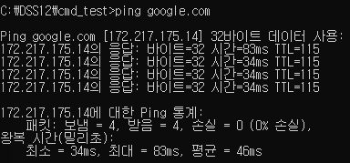
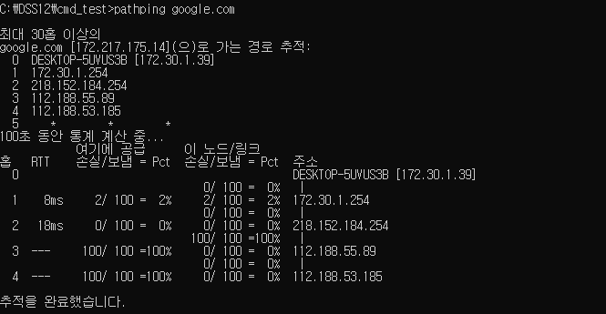
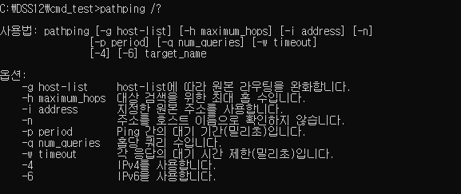

# ping
`ping packet internet groper`
    - 상태 컴퓨터의 네트워크 연결 상태 점검
    - 특정 도메인의 IP 확인

### 1. 기능
- 특정 도메인의 컴퓨터에 일정 크기의 패킷을 보내고, 상대 컴퓨터로부터 응답 메시지를 수신하여, 상대 컴퓨터의 네트워크 연결 상태를 확인하는 기능


### 2. 사용
- ping <도메인 주소>

```python
ping google.com
```


- 구글의 IP 주소 : 172.217.175.14
- 32바이트의 데이터(패킷)를 보냄
- 4번을 보냈고, 각 송신마다 응답 시간이 나옴


### 3. 옵션
- ping <옵션> <도메인>
    - 옵션을 붙여주면 다른 정보들을 확인 할 수 있다.

```python
ping /?
```


# path ping
- ping + tracert 의 기능
    - 임의의 사이트로 접속하는 경로를 추척함
    - 접속하는 동안에 거치는 라우터의 IP 확인
    - 라우터마다 패킷의 손실률을 계산하여 보여줌

### 1. 사용
- pathping <옵션> <도메인>


```python
pathping google.com
```


### 2. 옵션

```python
pathping /?
```



